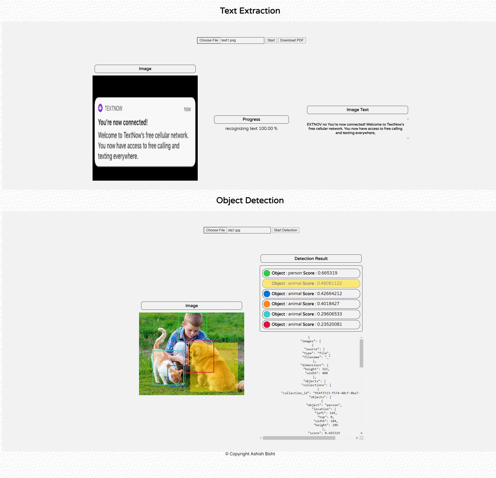

# A Prototype of Object Detection and Text Extraction from an Image   
## Requirements
* [IBM Visual Recognition Instance Credentials](https://cloud.ibm.com/catalog/services/visual-recognition)
     * [Visual Recognition API and Credentials](https://cloud.ibm.com/catalog/apidocs/visual-recognition-v4?code=node#addimages)
     * [Object Detection Model ](https://dataplatform.cloud.ibm.com/docs/content/wsj/analyze-data/visual-rec-obj-detect-create-model.html)
* [Npm](https://www.npmjs.com/get-npm)
* [NodeJS](https://nodejs.org/en/)

## Methodology
Tensorflow Script Link for Text Extraction Process  
IBM Visual Recognition Service for Object Detection

## Demo

